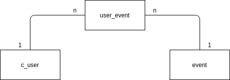

# Calendar

This application was built with the intention of booking times for some events.

## Technologies

* [Golang - v1.13](https://golang.org/)
* [Golang Echo Server - v4.1.16](https://github.com/labstack/echo)
* [Docker - v18.09.5](https://www.docker.com/)
* [Docker-Compose - v1.23.1](https://docs.docker.com/compose/)
* [Material-UI](https://material-ui.com/pt/)
* [React Hooks](https://pt-br.reactjs.org/docs/hooks-intro.html)
* [React Redux](https://redux.js.org/basics/usage-with-react)
* [PostgreSQL - v10.12](https://www.postgresql.org/)
* [PGAdmin4](https://www.pgadmin.org/)

## Architecture

The architecture of the database can be seen in the image below:




## Run

To run the application you must first verify that [Docker](https://docs.docker.com/engine/install/ubuntu/) and [Docker-Compose](https://docs.docker.com/compose/install/) are installed on your pc. If not click on the links and install them.

And execute the command:
```bash
sudo docker-compose up --build
```
### Testing

You can run some tests by checking the database on **PGAdmin4** where user and password is"haha1212" and the user of database server are "postgres" and the password is "haha1212", or acess the page in this URL

```bash
localhost:5002
```